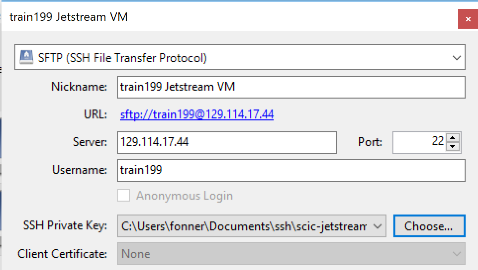

# Data Management and Movement

<center></center>

## Challenges

The cloud was originally built for web services, not for science. In many ways, cloud computing is a natural fit for computational research, but the biggest potential challenge is in data management.

Data management is already hard for many scientific disciplines without using "ephemeral" compute resources in the cloud. Fortunately, there are good approaches to cloud data movement and management, but they may require learning some new tools and accounting for new pitfalls. Some key questions are:

- What protocol and software will you use for moving data to and from your cloud VM?
- How will you transfer results to more permenant storage?
- How should you plan for compute / data storage costs in your grant?


### Data Movement Costs

For the training course, we are working in the Jetstream research cloud.  Moving data to and from VMs in the Jetstream cloud does not incur charges.  This is not true for the public cloud.  At the time of the class, pricing for data transfers for Amazon Web Services is:

|Type|Pricing|
|----|-------|
|Data transfer IN to Amazon EC2| $0 per TB|
|Data transfer OUT from Amazon EC2| $90 per TB|

Current Amazon pricing is [here](https://aws.amazon.com/ec2/pricing/on-demand/).  The important takeaway message is that data management in the public cloud for large datasets can become very expensive.  It is critical to think about the data lifecycle beforehand.

> #### Discussion Questions
> 
> - For your scientific domain, how do others share their datasets? How could the _status quo_ be improved?
> - If you wish to make an open dataset available to other researchers, where would you put it?  Who pays the cost of data hosting and data transfer?
> - Why has the NSF and other funding agencies invested in private clouds like Jetstream?

## Transferring Data to/from VMs

### Using SFTP

If you are moving files either from your shell-enabled laptop or from a Linux system, transferring files over SSH is by far the simplest and most widely supported.  Two "standard" Linux commands are designed to accomplish the task.

#### scp

`scp` ("secure copy") is a command line utility that uses SSH to make encrypted transfers of one or more files from one location to another.  It is dead simple but has no threading or restart capability if interrupted.  It is best suited when the number of files being transferred is relatively small (i.e. hundreds of files or less, a few GB or less).  The syntax follows the pattern:

```
$ scp [optional flags] <source> <destination>
```

If either the source or destination is "local", it is formatted like a regular path.  If it resides on a remote server, it has the format `username@server:/path/to/file`

For example, if you have a shell on your laptop, you can upload a file to your VM with the following:

```
$ echo "hello world" >> test.txt
$ scp test.txt train###@<ip address>:'$HOME'
```

To download a file from the VM, just reverse the "source" and "destination".

```
$ scp train###@<ip address>:~/test.txt ./test2.txt
```

`scp` supports "recursive" transfers of all files and subdirectories with the `-r` flag. `scp` can also be used to transfer files between two remote servers.

> #### Exercise
> 
> - Other than `-r`, what is another useful flag that you might use? How do you discover what flags are supported?
> - If you have access to a Linux shell other than your VM, try moving a file from one remote system to another.  How does the `-3` flag change things?
> - Can `scp` be used to download URLs?

#### rsync 

`rsync` uses SSH to sync all files within a pair of directories.  It only transfers the "differences" between the two, so restarting after an interruption is supported. The syntax is similar to `scp`, but there are many more flags that can tweak the behavior of `rsync`:

```
$ rsync -azv source destination
```

It is important to note that either the source or destination must be a local path.  Rsync does not support coppying files between two remote servers.

> #### Exercise
> 
> - Look at some of the different rsync flags with the `man rsync` command. Give an example when the `-a` flag would be useful.  

### Using HTTP/HTTPS

#### wget
There are a couple of ubiquitous command line tools for downloading files from the web.  The simplest is `wget`. Try the following from your VM:

```
$ wget https://raw.githubusercontent.com/fnichol/names/master/data/adjectives.txt
$ wget https://raw.githubusercontent.com/fnichol/names/master/data/nouns.txt -O noun_list.txt
$ wget --help
```

`wget` is extremely flexible, with more command line flags than can be reasonably memorized, but the simplest invocations are fortulately the most common use cases.

#### curl

Sometimes `wget` is not available on systems, but `curl` is installed, and it is equally capable of downloading from the web.  The syntax is just a little more complicated.  It is easy to get lost in the options if you type:

```
$ curl --help
```

A few commonly used aruments are:

- `-L` - "follow redirects" in case the URL you are using is a short link to another location.
- `-o` - like `-O` for `wget`, it lets you specify the name of the file that receives the output.  If you don't use this option, curl will print everything to the terminal!
- `-k` - sometimes academics let their SSL certifications expire.  If you trust the host, `-k` will permit insecure connections and ignore the SSL certification error.

```
$ curl -L https://github.com/docker/compose/releases/download/1.24.1/docker-compose-`uname -s`-`uname -m` \
  -o /usr/local/bin/docker-compose
```

> #### Exercise (Required)
> 
> Use either `wget` or `curl` (or both) to download this file to your VM:
>
> ```
> https://downloads.globus.org/globus-connect-personal/linux/stable/globusconnectpersonal-latest.tgz
> ```


### Globus

Globus provides a graphical user interface, some neat features for transferring files between systems, and a way of navigating between authentication identities.  For the context of this class, we want to do three things:

1. Register our VM as a Globus personal endpoint
2. Activate the XSEDE TACC Stampede2 Globus endpoint
3. Transfer files between systems

#### Create a New Endpoint

In the last "Exercise" we downloaded `globusconnectpersonal-latest.tgz` to your VM. Next, we will use that to setup Globus on our VM.  Jetstream has already published and maintains a tutorial for this, so we will follow their instructions here:

[https://iujetstream.atlassian.net/wiki/spaces/JWT/pages/457408518/Transferring+Files+with+Globus](https://iujetstream.atlassian.net/wiki/spaces/JWT/pages/457408518/Transferring+Files+with+Globus)

#### Activate the XSEDE TACC Stampede2 Endpoint

High Performance Computing resources that are part of the National Science Foundation's XSEDE project have endpoints that users can activate to manage files via Globus.

1. Click on "Endpoints" on the Globus portal or go to [https://app.globus.org/endpoints](https://app.globus.org/endpoints).  If you have not already logged in, you will be redirected to a login page.
2. In the "Search all endpoints" box at the top of the page, type "XSEDE" and press Enter
3. Click on "XSEDE TACC stampede2", which will take you to a new page with action buttons on the right
4. Click "Activate" and use your XSEDE credentials for your training account to login

#### Transfer files

At this point, you should be able to go to the "File Manager", which will display a "left hand" and "right hand" pane.  You should be able to select your VM for one of those panes and Stampede2 for the other.

On the Stampede2 side, set the path to

```
/work/01114/jfonner/public
```

Try transferring `gettysburg.txt` from Stampede2 to your VM. You will have to "Refresh" the VM to see that the file has transferred.

Notice that actions in Globus are asynchronous.  When you initiate a file transfer, it will happen between the two remote systems and notify you of progress in the "Activity" page.

### Cyberduck

There are many FTP Clients that provide a graphical user interface for moving files between systems, but CyberDuck has a number of features that make it the best choice if you do not already have an FTP client that you prefer.  It is available for download at:

[https://cyberduck.io/](https://cyberduck.io/)

If you are able, install Cyberduck on your laptop and follow along.

#### Adding a remote host to Cyberduck

If you click the `+` in the bottom left corner of Cyberduck, it will open a window where you can configure a connection to a remote host.  It will look something like the following:

<center></center>

- at the top, be sure to select "SFTP"
- Nickname: this can be whatever you want.  A human readable nickname for your Jetstream VM
- Server: the IP address or hostname of your server.
- Port: should automatically be 22.  If it isn't, make sure you have SFTP selected at the top.
- Username: in this case, your training account
- SSH Private Key: To be able to connect to Jetstream, you must use an SSH Key pair.  Cyberduck can use the same private key that you generated earlier in the class.

When done, you can just click the `x` in the top right corner and close the window.  Cyberduck saves your changes as soon as you type them.

Next, double click the entry for your Jetstream VM to initiate a connection with the remote host.  It should display the contents of your $HOME directory, and you can navigate and move files similar to the files explorer app on your operating system.

> #### Exercise
> 
> Try downloading and uploading files from your laptop to Jetstream.

## Discussion

- What data should be stored as part of the VM image?
- What data should be stored inside of containers (i.e. as a research best practice)?
- What data should not be stored in those two locations?
- How does data movement in the cloud integrate into cloud-based scientific workflows?