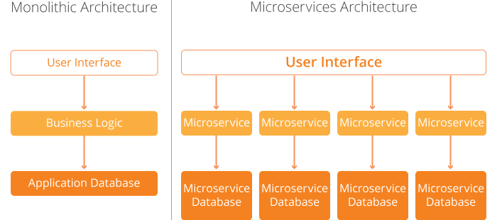
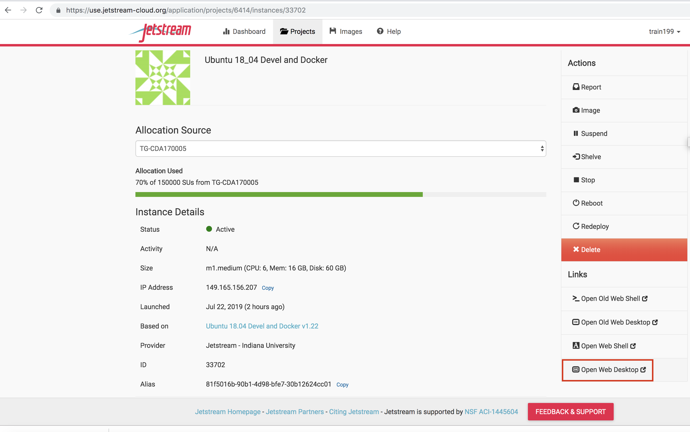

## Docker Compose
Docker compose is a tool that allows you to build, configure, and deploy
multiple containers all from a single configuration file. It is very popular
with web developers, because it allows them to separate distinct services and
work on them in isolation.



The idea is each container provides a single service, and can be scaled up/down
as needed. Each container/service can be written in a different language, have different
dependencies, and easily be managed by different teams. This isolation is very
desirable for maintainability, but we must also be able to easily communicate between containers.
To manage container interactions we need to specify ports and mount volumes, which
can get pretty tedious as the number of containers increases. The benefit of
docker compose is it allows us define all of our services in a config file (yaml),
and spin up all of our containers at the same time.
The whole process is controlled by the config file (`docker-compose.yml`),
we'll use version 3 of the compose format in our examples, ex:

```
version: '3'
service:
  product-service:
    build: ./product
    volumes:
     - ./product:/src/app/
    ports:
     - 5001:80
  other-service:
    image: jurrutia/app:tag
    volumes:
     - ./local:/continer/loc
    ports:
     - 5000:80
    depends_on:
     - product-service
```

To find out which version of docker compose you have installed, you can run:
```
docker-compose -v
docker-compose version
```
To learn more about the commands that you can use with docker compose, you can
check the embedded help documentation:

```
docker-compose --help
```

Compose creates a virtual network for all of the containers, so any container
in the compose file can access any other container. Making it much easier to
define and create multi-container applications.

### Building and Running A Containerized Pipeline

```
git clone https://github.com/JoshuaUrrutia/docker_compose_pipeline.git
cd docker_compose_pipeline/
docker-compose config
docker-compose build
```
<!-- *Big pause (5 min)* Talk about tradeoffs here. -->
The build process will take ~5 minutes, we're compiling a lot of this software from
source. When you build on your local laptop it can get pretty hot during this step.
There are a lot of tradeoffs to consider here:
Build speed vs deployment speed vs stability vs maintainability. Do you want to just
add pre-compiled binaries to your container image? Build and deployment speed will increase
but you'll lose some flexibility. Want to compile everything from source? This will
give you a lot of flexibility, but the build process will take longer, and the large
amount of code can be more difficult to maintain.
These goals can all be competing or synergistic depending on design.


```
docker-compose up
cd working/
ls
./run_containers.sh SRR8528615_C42B_siControl_R1.fastq.gz SRR8528615_C42B_siControl_R2.fastq.gz
./run_containers.sh SRR8528617_C42B_siREST_R1.fastq.gz SRR8528617_C42B_siREST_R2.fastq.gz
```
Each one of these alignments will take ~6 minutes, so be sure to start the second one
after the first is completed.
<!-- *6 min *m1.medium (CPU: 6, Mem: 16 GB, Disk: 60 GB) -->

### Scaling Containers
You can scale containers as necessary, for example if you'd like multiple instances of
the trimmomatic app, you can scale up that service specifically:

```
docker-compose up --scale trimmomatic=4
docker-ps
docker-compose down
```
Let's take a look at the outputs of our pipeline. MultiQC aggregates logs and displays
them as a webpage, it gives a nice summary of important alignment statistics.

Open a web shell, and navigate to the MultiQC report:


Or use `scp` (secure copy) to copy the report from jetstream to your machine:
```
scp $USERNAME@$IP_ADDRESS:/home/$USERNAME/docker_compose_pipeline/working/multiqc/multiqc_report_1.html .
```

Once you've tested and you're happy with the containers you can push them all to your Docker Hub so
so anyone can pull and use them:
```
docker-compose push
```

### What Are We Doing With This Pipeline
This pipeline does QC and alignment for sequencing data.
I've taken some public sequencing data from human cancer cell lines that were
treated with siRNA to knockdown a particular gene (REST).
GEO:
<https://www.ncbi.nlm.nih.gov/sra?term=SRX5331845>
<https://www.ncbi.nlm.nih.gov/sra?term=SRX5331843>

REST is a transcriptional repressor that is often deactivated in aggressive prostate cancers.
Lost of REST expression can allow the cancer to transdifferentiate to one of the most
lethal forms: neuroendocrine prostate cancer.

So let's check REST expression as a sanity check on the experiment.
First we need to find out the ensembl ID for
[REST](https://useast.ensembl.org/Homo_sapiens/Gene/Summary?db=core;g=ENSG00000084093;r=4:56907876-56966678).

I scaled this example down a little so it would run quickly. I took the first 1 million
reads from each of these sequence files, and aligned them to only chromosome 4 of the human genome:
<https://useast.ensembl.org/info/data/ftp/index.html>

We can see the ensembl ID is `ENSG00000084093`, so let's check REST expression
in our two alignments:
```
grep 'ENSG00000084093' star/SRR8528615_C42B_siControl/ReadsPerGene.out.tab
grep 'ENSG00000084093' star/SRR8528617_C42B_siREST/ReadsPerGene.out.tab
```

We have lower expression of REST in our siREST knockdown, which is a nice confirmation
that the experiment was successful. To get a clearer picture of which genes are
affected by REST knockdown we would want to align to the whole genome (or at least
the CDS), and run differential expression analysis with another tool (DESeq2,
RSubread, EdgeR, etc.) to get statistics on genes that are affected.

Top: [Course Overview](../../index.md)
