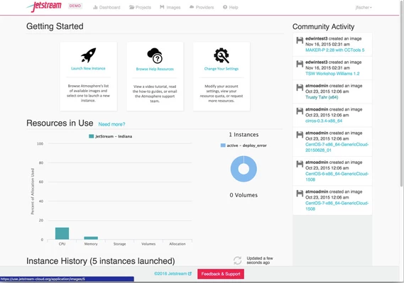
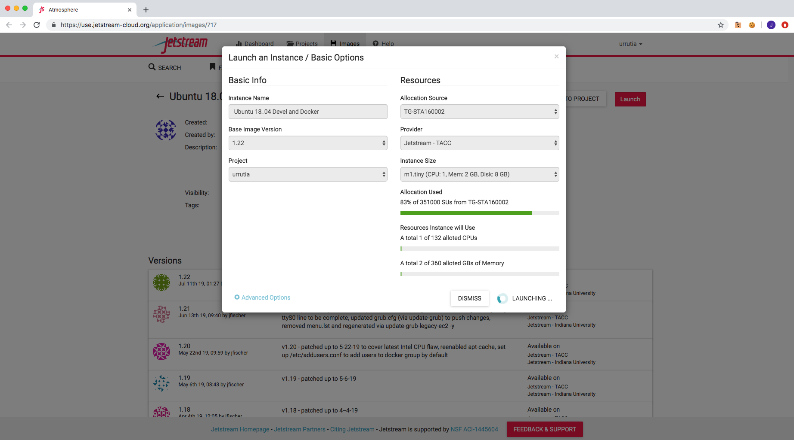

# Introduction to Cloud Computing


This module will be partially interactive. Please follow along on your own computer.


## What is a cloud?

A "cloud" is a computer system that provides users with shared access to on-demand computing resources via the internet.


<center></center>


### Goals/Benefits
  * Resource utilization
  * Scalability and Elasticity
  * Reproducibility by way of Programmability
  * Reliability through redundancy


### Cloud Means Different Things to Different Groups

Different kinds of people use clouds for different purposes.
  * System Administrators - use cloud to automate operations.
  * Software Developers - build applications on cloud servers and platforms.
  * Computational scientists - Write codes to analysis scientific data in the cloud.

In this course we will try to exposure you to each of these views.

### Cloud service models

Clouds can offer different service models:
  * Infrastructure-as-a-service (Iaas) - virtual servers, networks, firewalls, etc. (Openstack, Jetstream, AWS, Azure)
  * Platform-as-a-service (Paas) - deploy applications without managing virtual servers (Agave, Google App Engine, Heroku)
  * Software-as-a-service (Saas) - Ready to use software application (Jupyterhub, Gmail, Office365)

Also: emerging models such as functioni-as-a-service.

### Infrastrcture-as-a-service

Key concepts:
  * Virtual Machines (VMs) - Simulate a physical computer through software.
  * Software defined networking: Routers, networks and subnets - used to connect VMs to other computers.
  * Security groups - firewall rules enabling or disabling network traffic to/from ports on the VMs.


### Initial setup
First we need to login to Atomosphere:

Step-by-step guide
1. To start the VM provisioning process, navigate to <https://use.jetstream-cloud.org>.

2. Click Login in the top right to authenticate using your XSEDE credentials:


3. On the Globus Auth screen select XSEDE and click Continue.


4. Enter your XSEDE credentials. Best results will occur if you treat your username as if it were case-sensitive when using Jetstream.


5. After you type in your XSEDE username and password, confirm whether you will allow your credentials to be used to access Jetstream.  You may wish to review the terms of service and privacy policies linked on that page. Generally, this screen will only be displayed the first time you log into Jetstream, however, changes to Globus Auth might cause this screen to be displayed on a later login to Jetstream.  To use Jetstream, click Allow.


6. To proceed, click  Allow and the web interface to Jetstream will load.


7. Once authenticated via Globus Auth, the Jetstream Dashboard will be displayed.  On this page you will be able to:

     * launch a new instancedas
     * browse help resources
     * change settings
     * view resources and usage history
     * view a Jetstream Community Activity feed
     

 8. Now we can simply select an image that has docker installed:

     <https://use.jetstream-cloud.org/application/images/717>

 9. To get started using a Jetstream virtual machine, click Launch New Instance from the Dashboard screen. On the list of images page, scroll through the the list of images or enter an image name, tag or description in the search box. For instance, to locate images named or tagged with “Docker”, enter that text in the search bar. The search is not case sensitive.  
    <center></center>

10. After selecting an image, details about that image will be displayed.  From here, add the selected image to a project, star it as a favorite, or edit image information.  Click Edit details to:

    * Update the name of the image
    * Set a date to hide the image from public view
    * Modify the description
    * Add or delete tags
    * Click Save
    * Click Launch

    ```
    Notes:
    You must redeploy or reboot an instance AFTER adding or updating your SSH public-keys in order to have those keys added to the instance.

    DSA/DSS keys are deprecated for Ubuntu 16.04 and newer instances. Please use RSA keys.
    ```

3.  On the Launch an Instance / Basic Options screen:

    * Enter a name for the instance
    * Select the image version if there are multiple versions available
    * Select or create a project to hold this instance. If you have any existing projects, they will be shown here and you can select one. If you don't have any existing projects, click Create New Project and fill in Project Name and Description. A detailed description is optional, but it is recommended to include any grant names or other easily identifying details so others working with you may easily find it. Click Create to create the new project.
    * Indicate the allocation source
    * Choose the provider to run on, Indiana or TACC
    * Choose the instance size. This indicates the vCPUs, memory, and disk size for the VM. See the Virtual Machine Sizes table to show the available options and the SUs consumed per hour.  Check projected resource usage: Allocation Used and Resources Instance will Use.
    * Click Launch Instance to start the initialization and build of the instance.
    

Below are several screens that typically displayed during the provisioning process.


Atmosphere deployment will add two keys to your authorized_keys file – one for GateOne (the old web shell) and one for Apache Guacamole (the new web shell) - the comment for both will just have your XSEDE username. We are working on updating that to indicate that they are web shell keys.
Step-by-step guide to Adding SSH public keys to Atmosphere settings:
1. To add your ssh key(s) to Jetstream, click on your username in the upper right hand corner and then click Settings.

    


2.  On the Settings screen, under Advanced, click Show More, to expand the section for adding your SSH key.  Check the box that says “Enable ssh access into launched instances” and then click the green plus sign to actually add your key.

    


3. On the next screen give the key a descriptive name and then paste the contents of your PUBLIC ssh key into the dialog box.
```
cat ~/.ssh/id_rsa.pub
```


4. After you have pasted in your SSH key, click Confirm.  You will then be back at the Settings screen with your key shown in the SSH Configuration section.

5. You must redeploy or reboot an instance AFTER adding or updating your SSH public-keys in order to have those keys added to the instance.

If you decide to use the web shell instead of ssh-ing in you'll likely want to setup the webshell to accept copy/paste from your clipboard:
<https://iujetstream.atlassian.net/wiki/spaces/JWT/pages/141525076/Logging+in+with+Web+Shell+-+also+copying+and+pasting>


## Intro to Docker

Intro slides: <https://docs.google.com/presentation/d/1RVyQ1CDamNLRw9mIcUec-IoTcH0-wbQcXsjbRB5NAws/edit?usp=sharing>


Typically, accessing the docker daemon requires root or to be in the docker group. For the purposes of this introduction,
 we can simply do everything as the root user:
```
$ sudo su - root
```

Make sure you can access the docker daemon; you can verify this by checking the version:
```
$ docker version
Client:
  Version:           18.09.7
  API version:       1.39
  Go version:        go1.10.1
  Git commit:        2d0083d
  Built:             Wed Jul  3 12:13:59 2019
  OS/Arch:           linux/amd64
  Experimental:      false

Server:
  Engine:
   Version:          18.09.7
   API version:      1.39 (minimum version 1.12)
   Go version:       go1.10.1
   Git commit:       2d0083d
   Built:            Mon Jul  1 19:31:12 2019
   OS/Arch:          linux/amd64
   Experimental:     false

```

Create a test directory to contain your docker work:
```
$ mkdir docker; cd docker
```

### Docker Images and Tags, Docker Hub, and Pulling Images
A Docker image is a container template from which one or more containers can be run. It is a rooted filesystem that,
by definition, contains all of the file dependencies needed for whatever application(s) will be run within the
containers launched from it. The image also contains metadata describing options available to the operator running
containers from the image.

One of the great things about Docker is that a lot of software has already been packaged into Docker images. One source
of 100s of thousands of public images is the official docker hub: <https://hub.docker.com>.

The docker hub contains images contributed by individual users and organizations as well as "official images". Explore
the official docker images here: <https://hub.docker.com/explore/>

Most modern programming languages offer an official image. For example, there is an official image for the Python programming language: <https://hub.docker.com/_/python/>

Docker supports the notion of image tags, similar to tags in a git repository. Tags identify a specific version of an
image.

The full name of an image on the Docker Hub is comprised of components separated by slashes. The components include a
"repository" (which could be owned by an individual or organization), the "name", and the "tag". For example, an image
with the full name
```
jstubbs/test:0.1
```
would be the "test" in the "jstubbs" repository and have a tag of "0.1". TACC maintains multiple repositories on the Docker Hub
including:
```
tacc
taccsciapps
agaveapi
abaco
```
Official images such as the python official image are not owned by a repository, but all other images are.

To pull an image off Docker Hub use the `docker pull` command

```
$ docker pull python
Using default tag: latest
latest: Pulling from library/python
cc1a78bfd46b: Pull complete
. . .
```

As indicated in the output, if no tag is specified the "latest" tag is pulled. You can verify that the image is
available on your local machine using the `docker images` command:
```
$ docker images
REPOSITORY             TAG                 IMAGE ID            CREATED             SIZE
jstubbs/test           latest              9dfe5a2c4b43        52 minutes ago      81.2 MB
python                 latest              a5b7afcfdcc8        3 hours ago         912 MB
```

### Running a Docker Container
We use the `docker run` command to run containers from an image. We pass a command to run in the container. Similar
to running other programs on Unix systems, we can run containers in the foreground (attached) or in the backgrouns.

#### Running and Attaching to a Container
To run a container and attach to it in one command, use the `-it` flags. Here we run `bash` in a container from the ubuntu image:
```
docker run -it ubuntu bash
root@c10f52ac8ba2:/# ls
root@c10f52ac8ba2:/# exit
ls
```
#### Running a Container in Daemon mode ####
We can also run a container in the background. We do so using the `-d` flag:
```
docker run -d ubuntu sleep infinity
docker ps
docker ps -a
```


### Installing and Running the Containerized Classifier Application

We have packaged up a self-contained image classifier application based on the TensorFlow library. Our image is
available from the DockerHub. To download it, issue the following commnand:

```
$ docker pull taccsciapps/classify_image
```

What you are downloading is a complete application that will run an image classifier algorithm on an image
that is publicly available from the internet.

Once the download is complete, we can run one or more containers from our image. This particular image requires
an environment variable, `$URL`, containing the address to a publicly available image, to be passed in at run time.

For example, we can run our image classifier program on the 3 different images:


```
$ docker run -it --rm -e URL=https://raw.githubusercontent.com/TACC/taccster18_Cloud_Tutorial/master/classifier/data/dog.jpeg taccsciapps/classify_image
$ docker run -it --rm -e URL=https://www.dropbox.com/s/f93aixy0r5f1fz1/jimo.jpeg?raw=1 taccsciapps/classify_image
$ docker run -it --rm -e URL=https://www.dropbox.com/s/80o4vbzrz4eyzp0/mpackard.jpg?raw=1 taccsciapps/classify_image
```


### Additional Remarks on Running Containers

#### Running Additional Commands in a Running Container ####
Finally, we can execute commands in a running container using the `docker exec` command. First, we need to know the container id, which we can get through the `docker ps` command:

```
~ $ docker ps
CONTAINER ID        IMAGE               COMMAND             CREATED             STATUS              PORTS               NAMES
e372ff3fde69        ubuntu              "sleep infinity"    2 minutes ago       Up 2 minutes                                   jovial_lewin
```

Here we see the container id is `e372ff3fde69`. To execute `bash` in this container we do:
```
docker exec -it e372ff3fde69 bash
ls
exit
```
At this point we are attached to the running container. If our bash session exits, the container will keep running because the `sleep infinity` command is still running.

*Note: The `docker ps` command only shows you running containers - it does not show you containers that have exited. In order to see all containers
on the system use `docker ps -a`.

```
root@js-104-88:~/docker# docker ps -a
CONTAINER ID        IMAGE               COMMAND             CREATED             STATUS                     PORTS               NAMES
e372ff3fde69        ubuntu              "sleep infinity"    2 minutes ago       Up 2 minutes                                   jovial_lewin
c10f52ac8ba2        ubuntu              "bash"              7 minutes ago       Exited (0) 6 minutes ago                       focused_payne
```


### Removing Docker Containers ###
You can stop the container with the `docker stop` command. Pass either the container ID or the Name to docker stop:
```
docker stop e372ff3fde69
docker stop jovial_lewin
```
We can remove a docker container using the `docker rm` command (optionally passing `-f` to "force" the removal if the container is running). You will need the container name or id to remove the container:
```
$ docker rm -f e372ff3fde69
```


These IDs will be unique for your container.

### Building Images From a DockerFile
We can build images from a text file called a Dockerfile. You can think of a Dockerfile as a recipe for creating images.
The instructions within a dockerfile either add files/folders to the image, add metadata to the image, or both.

#### The FROM instruction
We can use the `FROM` instruction to start our new image from a known image. This should be the first line of our Dockerfile. We will start our image from an official Ubuntu 16.04 image:

```
FROM ubuntu:16.04

```

#### The RUN instruction
We can add files to our image by running commands with the `RUN` instruction. We will use that to install `wget` via `apt`. Keep in mind that the the docker build cannot handle interactive prompts, so we use the `-y` flag in `apt`. We also need to be sure to update our apt packages.

The Dockerfile will look like this now:
```
FROM ubuntu:16.04

RUN apt-get update && apt-get install -y wget
```

#### The ADD instruction
We can also add local files to our image using the `ADD` instruction. We can add a file `test.txt` in our local directory to the `/root` directory in our container with the following instruction:

```
ADD test.txt /root/text.txt
```

A complete Dockerfile for the classify_image application as well as the necessary scripts and supporting files is available from the Tutorial gihub repo:
<https://github.com/TACC/taccster18_Cloud_Tutorial/tree/master/classifier>


#### Building the Image
To build an image from a Dockerfile we use the `docker build` command. We use the `-t` flag to tag the image: that is, give our image a name. We also need to specify the working directory for the buid. We specify the current working directory using a dot (.) character:
```
docker build -t classify_image .
```

Note that this command requires all the files in the `classifier` directory in the Tutorial github repo (https://github.com/TACC/taccster18_Cloud_Tutorial/tree/master/classifier)


## Jupyter

Online notebooks and access to other TACC resources.

(https://jupyter.tacc.cloud)

## Atmosphere (Jetstream Project)

1-Click access to VMs.

(https://use.jetstream-cloud.org)
