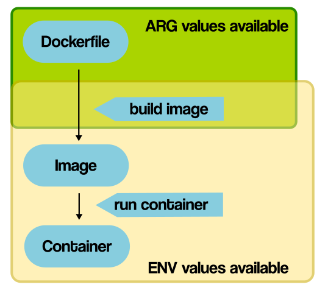

## Docker in the Cloud (Building a Jupyter Notebook image)

This is going to be a dual-purpose interactive session where we build up a production-ready Docker image for running a Jupyter notebook while focusing on best practices for building a good Dockerfile.

Since this is larger Dockerfile and it will be onerous to type each command or copy-n-paste, let's download the Dockerfile from GitHub to our Jetstream VM:

```$ wget https://raw.githubusercontent.com/eriksf/jupyter_notebook/master/Dockerfile```

In addition, this Docker build takes approximately 20-25 minutes, so let's kick off the build and then talk about how the Dockerfile is constructed:

```$ docker build -t <dockerhub username>/jupyter_notebook:<version> .```

### Creating a Docker image

There are basically two ways to create a Docker image:

1. Run a container, make changes to the container, then run `docker commit` to save a new image

   For example:

       $ docker run -it ubuntu:bionic /bin/bash
       root@7b4172124b5f:/# cd
       root@7b4172124b5f:~# ls
       root@7b4172124b5f:~# echo "testing..." >test.txt
       root@7b4172124b5f:~# ls
       test.txt

       root@7b4172124b5f:~# apt-get update
       Get:1 http://security.ubuntu.com/ubuntu bionic-security InRelease [88.7 kB]
       Get:2 http://archive.ubuntu.com/ubuntu bionic InRelease [242 kB]
       Get:3 http://archive.ubuntu.com/ubuntu bionic-updates InRelease [88.7 kB]
       Get:4 http://archive.ubuntu.com/ubuntu bionic-backports InRelease [74.6 kB]
       Get:5 http://security.ubuntu.com/ubuntu bionic-security/main amd64 Packages [588 kB]
       Get:6 http://security.ubuntu.com/ubuntu bionic-security/multiverse amd64 Packages [4172 B]
       Get:7 http://security.ubuntu.com/ubuntu bionic-security/universe amd64 Packages [725 kB]
       Get:8 http://archive.ubuntu.com/ubuntu bionic/restricted amd64 Packages [13.5 kB]
       Get:9 http://security.ubuntu.com/ubuntu bionic-security/restricted amd64 Packages [5436 B]
       Get:10 http://archive.ubuntu.com/ubuntu bionic/universe amd64 Packages [11.3 MB]
       Get:11 http://archive.ubuntu.com/ubuntu bionic/main amd64 Packages [1344 kB]
       Get:12 http://archive.ubuntu.com/ubuntu bionic/multiverse amd64 Packages [186 kB]
       Get:13 http://archive.ubuntu.com/ubuntu bionic-updates/multiverse amd64 Packages [7235 B]
       Get:14 http://archive.ubuntu.com/ubuntu bionic-updates/main amd64 Packages [898 kB]
       Get:15 http://archive.ubuntu.com/ubuntu bionic-updates/universe amd64 Packages [1245 kB]
       Get:16 http://archive.ubuntu.com/ubuntu bionic-updates/restricted amd64 Packages [10.8 kB]
       Get:17 http://archive.ubuntu.com/ubuntu bionic-backports/universe amd64 Packages [3930 B]
       Get:18 http://archive.ubuntu.com/ubuntu bionic-backports/main amd64 Packages [2496 B]
       Fetched 16.9 MB in 4s (4256 kB/s)
       Reading package lists... Done

       root@7b4172124b5f:~# apt-get install vim
       Reading package lists... Done
       Building dependency tree
       Reading state information... Done
       The following additional packages will be installed:
        file libexpat1 libgpm2 libmagic-mgc libmagic1 libmpdec2 libpython3.6 libpython3.6-minimal libpython3.6-stdlib libreadline7
        libsqlite3-0 libssl1.1 mime-support readline-common vim-common vim-runtime xxd xz-utils
       Suggested packages:
        gpm readline-doc ctags vim-doc vim-scripts
       The following NEW packages will be installed:
        file libexpat1 libgpm2 libmagic-mgc libmagic1 libmpdec2 libpython3.6 libpython3.6-minimal libpython3.6-stdlib libreadline7
        libsqlite3-0 libssl1.1 mime-support readline-common vim vim-common vim-runtime xxd xz-utils
       0 upgraded, 19 newly installed, 0 to remove and 9 not upgraded.
       Need to get 12.9 MB of archives.
       After this operation, 61.5 MB of additional disk space will be used.
       Do you want to continue? [Y/n] y
       ...

       root@7b4172124b5f:~# apt list --installed | grep vim

       WARNING: apt does not have a stable CLI interface. Use with caution in scripts.

       vim/bionic-updates,bionic-security,now 2:8.0.1453-1ubuntu1.1 amd64 [installed]
       vim-common/bionic-updates,bionic-security,now 2:8.0.1453-1ubuntu1.1 all [installed,automatic]
       vim-runtime/bionic-updates,bionic-security,now 2:8.0.1453-1ubuntu1.1 all [installed,automatic]
       root@7b4172124b5f:~# exit

       $ docker ps -a
       CONTAINER ID        IMAGE               COMMAND             CREATED             STATUS                     PORTS               NAMES
       7b4172124b5f        ubuntu:bionic       "/bin/bash"         4 minutes ago       Exited (0) 5 seconds ago                       hopeful_elbakyan

       $ docker commit 7b4172124b5f eriksf/myvim:0.0.1
       sha256:4c4ee94f1de618ea8fe4be8bc9f5531461f1628e6e9c4533a69f8b0872bdce7d

       $ docker images
       REPOSITORY                TAG                 IMAGE ID            CREATED             SIZE
       eriksf/myvim              0.0.1               4c4ee94f1de6        8 seconds ago       151MB
       ubuntu                    latest              3556258649b2        11 hours ago        64.2MB
       eriksf/jupyter_notebook   0.0.4               c3d00e2e5585        30 hours ago        3.86GB
       ubuntu                    bionic              4c108a37151f        5 weeks ago         64.2MB

       $ docker run -it eriksf/myvim:0.0.1 /bin/bash
       root@8e0fce1b512f:/# cd
       root@8e0fce1b512f:~# ls
       test.txt

       root@8e0fce1b512f:~# apt list --installed | grep vim

       WARNING: apt does not have a stable CLI interface. Use with caution in scripts.

       vim/bionic-updates,bionic-security,now 2:8.0.1453-1ubuntu1.1 amd64 [installed]
       vim-common/bionic-updates,bionic-security,now 2:8.0.1453-1ubuntu1.1 all [installed,automatic]
       vim-runtime/bionic-updates,bionic-security,now 2:8.0.1453-1ubuntu1.1 all [installed,automatic]
       root@8e0fce1b512f:~#

   Seems OK, but **DON'T DO THIS!**

   Why not?

    * Can't reproduce the image ("Golden image")
    * Stuck with the base image

2. Write a Dockerfile and the run `docker build` on it

   For the sake of reproducibility, this is the much better option.

   * Dockerfile in version control
   * A "recipe" for exactly how to build the image

### What is a Docker layer?

A Docker image consists of several layers. Each layer corresponds to the instructions in your Dockerfile. In current iterations of Docker only the following instructions actually create a layer; **RUN**, **COPY**, and **ADD**. The rest of the instructions will create an intermediate layer and do not influence the size of your image.


The command, `docker history`, will show the history (layer by layer) of your image:

```bash
$ docker history eriksf/jupyter_notebook:0.0.4
IMAGE               CREATED             CREATED BY                                      SIZE                COMMENT
c3d00e2e5585        31 hours ago        |1 BURL=https://raw.githubusercontent.com/ju…   117kB
08bc6912f0fb        31 hours ago        /bin/sh -c #(nop)  USER jupyter                 0B
b189a5d4b6c5        31 hours ago        |1 BURL=https://raw.githubusercontent.com/ju…   0B
2a9f0634c84a        31 hours ago        /bin/sh -c #(nop)  USER root                    0B
251d8f0fc286        31 hours ago        /bin/sh -c #(nop)  CMD ["start-notebook.sh"]    0B
009f9d4862ec        31 hours ago        /bin/sh -c #(nop)  ENTRYPOINT ["tini" "-g" "…   0B
9a37bc8251b4        31 hours ago        /bin/sh -c #(nop)  EXPOSE 8888                  0B
e353de005a4c        31 hours ago        |1 BURL=https://raw.githubusercontent.com/ju…   35.9kB
42ef7c2fdbd4        31 hours ago        |1 BURL=https://raw.githubusercontent.com/ju…   1.7GB
7a4c446161d1        31 hours ago        |1 BURL=https://raw.githubusercontent.com/ju…   210MB
18b8281e0539        31 hours ago        /bin/sh -c #(nop)  ENV MINICONDA_VERSION=4.6…   0B
aef1e7f703c5        31 hours ago        |1 BURL=https://raw.githubusercontent.com/ju…   0B
f93cdea8216d        31 hours ago        /bin/sh -c #(nop) WORKDIR /home/jupyter         0B
ea4488943fee        31 hours ago        /bin/sh -c #(nop)  USER jupyter                 0B
3bf1ee1e985f        31 hours ago        |1 BURL=https://raw.githubusercontent.com/ju…   397kB
ab8f4d2b4f87        31 hours ago        |1 BURL=https://raw.githubusercontent.com/ju…   3.77kB
7895a93d8a0a        31 hours ago        |1 BURL=https://raw.githubusercontent.com/ju…   10.1kB
91c4626271e7        31 hours ago        /bin/sh -c #(nop)  ARG BURL=https://raw.gith…   0B
98164ec0f93b        31 hours ago        /bin/sh -c #(nop)  ENV PATH=/opt/conda/bin:/…   0B
d7ae0f730896        31 hours ago        /bin/sh -c #(nop)  ENV CONDA_DIR=/opt/conda …   0B
739f519b276f        31 hours ago        |3 NB_GID=100 NB_UID=1000 NB_USER=jupyter /b…   1.68MB
6533933a2b97        31 hours ago        |3 NB_GID=100 NB_UID=1000 NB_USER=jupyter /b…   1.89GB
d4e8e01ce9a9        31 hours ago        /bin/sh -c #(nop)  USER root                    0B
d4fe3be3b6ee        31 hours ago        /bin/sh -c #(nop)  ARG NB_GID=100               0B
4e6be1e4f944        31 hours ago        /bin/sh -c #(nop)  ARG NB_UID=1000              0B
a2ca2cb78275        31 hours ago        /bin/sh -c #(nop)  ARG NB_USER=jupyter          0B
4f4598e3194f        31 hours ago        /bin/sh -c #(nop)  LABEL maintainer=Erik Fer…   0B
4c108a37151f        5 weeks ago         /bin/sh -c #(nop)  CMD ["/bin/bash"]            0B
<missing>           5 weeks ago         /bin/sh -c mkdir -p /run/systemd && echo 'do…   7B
<missing>           5 weeks ago         /bin/sh -c set -xe   && echo '#!/bin/sh' > /…   745B
<missing>           5 weeks ago         /bin/sh -c [ -z "$(apt-get indextargets)" ]     987kB
<missing>           5 weeks ago         /bin/sh -c #(nop) ADD file:4e6b5d9ca371eb881…   63.2MB
```

In general, you want to minimize the number (and size) of your layers.

### Building a Jupyter notebook image

There are a couple of things to think about as you are constructing your Dockerfile.

#### Understand the build context

The build context is the set of files/directories located at the specified PATH in the `docker build` command.

```$ docker build [OPTIONS] PATH```

* It's usually the current directory (with the Dockerfile)
* Don't send unecessary files to the Docker daemon
  * "Sending build context to Docker daemon 187.8MB"
* Exclude files in the build context with a *.dockerignore* file

#### Leverage the build cache

As Docker is building an image, it steps through your instructions (in order) and looks for existing images in its cache it can reuse. For **ADD** or **COPY** instructions, Docker examines the contents of the file(s) and calculates a checksum which it compares against the existing images. For other instructions like **RUN**, Docker just tries to match the command string itself. In either case, if a match is not found, the cache is invalidated and all subsequent instructions generate new images and the cache is not used.

* Order from less frequently changed to most changed
* In general, build tools, library dependencies, then app/tool generation

#### Jupyter notebook Dockerfile

```Dockerfile
FROM ubuntu:bionic
LABEL maintainer="Erik Ferlanti <eferlanti@tacc.utexas.edu>"
```
&nbsp;

* Avoid using `:latest` in your base image
* If others will be using the image, it's common practice to add a maintainer label

```Dockerfile
ARG NB_USER="jupyter"
ARG NB_UID="1000"
ARG NB_GID="100"

USER root
```
&nbsp;
* ARG vs. ENV
  * ARG available in Dockerfile and at build (override with `--build-arg` to build command)
  * ENV available in image build and in the container




```Dockerfile
# Install OS dependencies
RUN apt-get update && apt-get -yq dist-upgrade \
    && DEBIAN_FRONTEND=noninteractive apt-get install -yq --no-install-recommends \
       build-essential \
       bzip2 \
       ca-certificates \
       curl \
       fonts-liberation \
       git \
       inkscape \
       jed \
       jq \
       libsm6 \
       libxext-dev \
       libxrender1 \
       lmodern \
       locales \
       netcat \
       pandoc \
       python-dev \
       sudo \
       texlive-fonts-extra \
       texlive-generic-recommended \
       texlive-latex-base \
       texlive-latex-extra \
       texlive-xetex \
       tzdata \
       unzip \
       vim \
       wget \
    && rm -rf /var/lib/apt/lists/*
```
&nbsp;
* apt-get
  * Minimize the number of layers (RUN in one line)
  * Be wary of upgrade/dist-upgrade
  * Sort multi-line arguments, improves readability (diffs)
  * Use DEBIAN_FRONTEND=noninteractive inline when needed, not ENV


```Dockerfile
RUN echo "en_US.UTF-8 UTF-8" > /etc/locale.gen && locale-gen

# Configure environment
ENV CONDA_DIR=/opt/conda \
    SHELL=/bin/bash \
    NB_USER=${NB_USER} \
    NB_UID=${NB_UID} \
    NB_GID=${NB_GID} \
    LC_ALL=en_US.UTF-8 \
    LANG=en_US.UTF-8 \
    LANGUAGE=en_US.UTF-8
ENV PATH=${CONDA_DIR}/bin:$PATH \
    HOME=/home/${NB_USER}
```
&nbsp;
* Avoid EXPOSE or ENV (cheap instructions) at the top of the file
  * Especially if they change
  * If not needed by the build, put at the end of the file


```Dockerfile
# Add jupyter helper scripts
ARG BURL=https://raw.githubusercontent.com/jupyter/docker-stacks/master/base-notebook
RUN bash -c "cd /usr/local/bin && for target in fix-permissions start{\"\",-notebook,-singleuser}.sh; do wget -q ${BURL}/\$target && chmod a+rx \$target; done" && \
    mkdir /etc/jupyter && cd /etc/jupyter && wget -q ${BURL}/jupyter_notebook_config.py && \
    fix-permissions /etc/jupyter /usr/local/bin

# Enable prompt color in the skeleton .bashrc before creating the default NB_USER
RUN sed -i 's/^#force_color_prompt=yes/force_color_prompt=yes/' /etc/skel/.bashrc

# Create NB_USER (will be added to 'users' group)
RUN useradd -m -s /bin/bash -N -u ${NB_UID} ${NB_USER} && \
    mkdir -p ${CONDA_DIR} && \
    chown ${NB_USER}:${NB_GID} ${CONDA_DIR} && \
    fix-permissions ${HOME} && \
    fix-permissions "$(dirname ${CONDA_DIR})"

# Switch to jupyter user to install miniconda
USER ${NB_USER}
WORKDIR ${HOME}

RUN mkdir /home/${NB_USER}/work && fix-permissions ${HOME}

ENV MINICONDA_VERSION=4.6.14 \
    CONDA_VERSION=4.7.5

RUN cd /tmp && \
    wget --quiet https://repo.continuum.io/miniconda/Miniconda3-${MINICONDA_VERSION}-Linux-x86_64.sh && \
    echo "718259965f234088d785cad1fbd7de03 *Miniconda3-${MINICONDA_VERSION}-Linux-x86_64.sh" | md5sum -c - && \
    /bin/bash Miniconda3-${MINICONDA_VERSION}-Linux-x86_64.sh -f -b -p ${CONDA_DIR} && \
    rm Miniconda3-${MINICONDA_VERSION}-Linux-x86_64.sh && \
    ${CONDA_DIR}/bin/conda config --system --set auto_update_conda false && \
    ${CONDA_DIR}/bin/conda config --system --set show_channel_urls true && \
    ${CONDA_DIR}/bin/conda install --quiet --yes conda && \
    ${CONDA_DIR}/bin/conda update --all --quiet --yes && \
    conda list python | grep '^python ' | tr -s ' ' | cut -d '.' -f 1,2 | sed 's/$/.*/' >> ${CONDA_DIR}/conda-meta/pinned && \
    conda clean --all -f -y && \
    rm -rf ${HOME}/.cache/yarn && \
    fix-permissions ${CONDA_DIR} && \
    fix-permissions ${HOME}

# Install Jupyter Notebook, Lab, and Hub
RUN conda install --quiet --yes -c defaults -c conda-forge \
    'notebook=5.7.8' \
    'jupyterhub=1.0.0' \
    'jupyterlab=1.0.1' \
    'matplotlib' \
    'pandas' && \
    conda clean --all -f -y && \
    npm cache clean --force && \
    jupyter notebook --generate-config && \
    rm -rf ${CONDA_DIR}/share/jupyter/lab/staging && \
    rm -rf ${HOME}/.cache/yarn && \
    fix-permissions ${CONDA_DIR} && \
    fix-permissions ${HOME}

# Install Tini
RUN conda install --quiet --yes 'tini=0.18.0' && \
    conda list tini | grep tini | tr -s ' ' | cut -d '.' -f 1,2 | sed 's/$/.*/' >> ${CONDA_DIR}/conda-meta/pinned && \
    conda clean --all -f -y && \
    fix-permissions ${CONDA_DIR} && \
    fix-permissions ${HOME}

EXPOSE 8888

# Configure container startup
ENTRYPOINT [ "tini", "-g", "--" ]
CMD [ "start-notebook.sh" ]
```
&nbsp;
* ENTRYPOINT and CMD
  * Avoid ENTRYPOINT for containers that run command line tools, use for services
  * ENTRYPOINT can be overridden with `--entrypoint <string>` option to `docker run`
  * CMD is a default, can be overridden with the command passed to `docker run`
  * If ENTRYPOINT and CMD are both specified, CMD is argument to ENTRYPOINT
* EXPOSE
  * Documents that the container listens on this port
  * In order to actually publish the port you must use the `-p <host:container>` option of `docker run`


```Dockerfile
# Fix permissions on /etc/jupyter as root
USER root
RUN fix-permissions /etc/jupyter/

# Switch back to jupyter user to run notebook
USER ${NB_USER}

# Import matplotlib the first time to build the font cache.
RUN MPLBACKEND=Agg python -c "import matplotlib.pyplot" && \
    fix-permissions ${HOME}
```

#### Miscellaneous Tips

* Use COPY instead of ADD
  * COPY is simpler
  * ADD unpacks tarballs, get files from remote URLs
* Don't copy entire app directory at top of Dockerfile
  * ```COPY . /app/```
  * Be explicit; only copy what you need for the build step
  * If you actually want the whole directory, do it at the end of the Dockerfile
  * Any change in directory will bust cache
* Create ephemeral containers (as much as possible)
  * stopped/destroyed then rebuilt/replaced with minimal setup
* Don't run multiple services in the same container
  * Keep it simple/separation of concerns

#### Docker volumes

Volumes are the mechanism that Docker uses to persist data generated and used by containers. You can either use a bind mount or a Docker volume.


* Volumes vs bind mounts
  * Bind mounts dependent on the directory structure of the host machine
  * Volumes are completely managed by Docker
  * Volumes are created in Docker's storage directory on the host machine
  * Volumes can be managed by the Docker CLI

#### Run the Jupyter notebook container

```bash
$ docker run -p 8888:8888 -v $PWD:/home/jupyter/work <dockerhub username>/jupyter_notebook:<version>
id: ‘jovyan’: no such user
Executing the command: jupyter notebook
[I 05:24:58.827 NotebookApp] Writing notebook server cookie secret to /home/jupyter/.local/share/jupyter/runtime/notebook_cookie_secret
[I 05:25:02.688 NotebookApp] JupyterLab extension loaded from /opt/conda/lib/python3.7/site-packages/jupyterlab
[I 05:25:02.688 NotebookApp] JupyterLab application directory is /opt/conda/share/jupyter/lab
[I 05:25:02.693 NotebookApp] Serving notebooks from local directory: /home/jupyter
[I 05:25:02.693 NotebookApp] The Jupyter Notebook is running at:
[I 05:25:02.693 NotebookApp] http://(f0834dbe15cd or 127.0.0.1):8888/?token=a2e7a83ae7945965117838e4861c14d45d509f7d8c89ac5c
[I 05:25:02.694 NotebookApp] Use Control-C to stop this server and shut down all kernels (twice to skip confirmation).
[C 05:25:02.719 NotebookApp]

    To access the notebook, open this file in a browser:
        file:///home/jupyter/.local/share/jupyter/runtime/nbserver-6-open.html
    Or copy and paste one of these URLs:
        http://(f0834dbe15cd or 127.0.0.1):8888/?token=a2e7a83ae7945965117838e4861c14d45d509f7d8c89ac5c
```

In order to view the Jupyter notebook, copy the URL printed to STDOUT and replace the text in parentheses with the public IP address of your Jetstream VM.


Top: [Course Overview](../../index.md)
