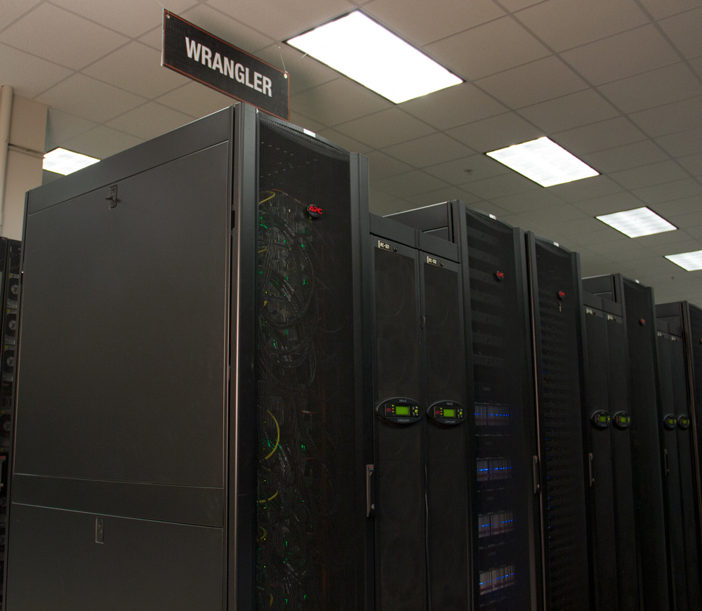

## Wrangler Basics

<center></center>

Wrangler is designed for large-scale data transfer, analytics, and sharing and provides flexible support for a wide range of software stacks and workflows. Its scalable design allows for growth in the number of users and data applications.

### Architecture

TACC Compute Nodes:

 * 96 24-core compute nodes (2304 cores total)
 * 500 TB Flash storage
 * 12.2 TB Distributed memory
 * 10 PB Georeplicated storage

### File Systems

You have access to the following spaces (5-digit lustre number and username vary for each user):
```
/home1/03439/wallen/      # 10 GB quota
/work/03439/wallen/       # 1 TB quota shared across all systems
/gpfs/flash/users/wallen/ # Treat like $SCRATCH on other systems
/data                     # Georeplicated allocated storage
```

Shortcuts to switch between the two spaces are:
```
$ cd
$ cdw
$ cdd
```

Or:
```
$ cd $HOME
$ cd $WORK
$ cdd $DATA
```


### Compilers

To identify available gcc and intel compilers, try:
```
$ module spider gcc
...
  Versions:
     gcc/4.9.1
     gcc/4.9.3
     gcc/6.3.0
     gcc/7.3.0
...
$ module spider intel
...
  intel: intel/15.0.3
  intel: intel/18.0.2
...
```

Loading a `gcc` module will put these compilers in your path:
  * `gcc` (C compiler)
  * `g++` (C++ compiler)
  * `gfortran` (Fortran compiler)

Loading an `intel` module will put these compilers in your path:
  * `icc` (C compiler)
  * `icpc` (C++ compiler)
  * `ifort` (Fortran compiler)

For MPI programming:
```
$ module spider mpi
...
     Versions:
        impi/5.0.3
        impi/18.0.2
...
```


Loading the `impi` module will put the compilers `mpicc`, `mpicxx`, `mpif77`, and `mpif90` in your path.


### Common Dependencies

Many programs you install will depend on some other program already being installed and in your path. This information is typically included in the online documentation or install instructions for the program you are trying to install. A good rule of thumb is to check if the dependency already exists on Lonestar5 before trying to install it yourself. Check out these modules on Lonestar5 which are common dependencies for other packages:
```
$ module spider mkl
$ module spider fftw
$ module spider hdf5
$ module spider cmake
$ module spider gsl
$ module spider boost
```


### Exercise

1. Try loading gcc and intel compilers at the same time. What happens?

Previous: [HPC Software Environment](hpc_software_environment_01.md) | Next: [Installing an Application](hpc_software_environment_03.md) | Top: [Course Overview](../../index.md)

