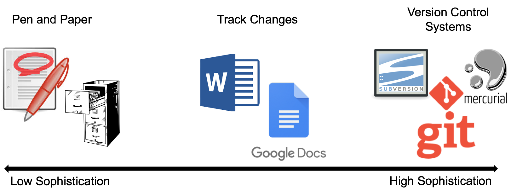

# Best Practices for Reproducibility in Research - Version Control

### Module Learning Objectives

This module will be fully interactive. Participants are **strongly encouraged** to follow along on the command line. Access to Stampede2 and a [GitHub account](https://github.com/join) are required. After completing this module, participants should be able to:

 * Describe the importance of reproducibility in Life Sciences
 * Create a new Git repository hosted on GitHub
 * Clone a repository, commit and push changes to the repository
 * Track the history of changes in files in a Git repository
 * Work collaboratively with others on the content in a Git repository
 * Perform basic branching, forking, and tagging operations

### Why is Reproducibility Important?

Reproducibility gives validity to science. To present a scientific result as valid, the assumption must be that if you or any other person reruns the same experiments under the same conditions, they will arrive at the same result. Without this assumption, results become more or less an observational data point. In order to reproduce / replicate a typical wet-lab life sciences experiment, you may need to know:

 * Experimental conditions
 * Reagent(s) used
 * Equipment used
 * Instrument(s) used
 * Incubation times
 * Dose / concentration
 * Cell strains
 * ... etc.

What must be known to reproduce an experiment in computational sciences?

 * Data 
 * Software identity
 * Software version
 * Number of replicas
 * Parameters
 * Configurations
 * When something was run
 * Code
 * Platform / OS

### How can we Achieve Reproducibility in Computational Science?

**Version control** can be considered the "lab notebook of the digital world". Version control systems are a set of tools used to track and manage changes in digital information. A form of version control you are probably already familiar with is "Track Changes" feature in Microsoft Word. It is useful for some applications, but long-term provenance is difficult.

In this workshop, we will look at the version control system **Git**. Of the several version control systems available (Git, Subversion, CVS, Mercurial), our group mostly uses Git, and we generally find that it is:

 * Easy to collaborate
 * Conveniently supports multiple concurrent versions (branches)
 * Tag releases or snapshots in time
 * Restore previous versions of files
 * What it lacks in user-friendliness it makes up for in good documentation
 * Intuitive web platforms available

GitHub is a web platform where you can host and share Git repositories ("repos"). (The paid version allows you to have private repos, otherwise they are public by default). Much of what we will do with this section requires you have a GitHub account.

### What can you do with Git / GitHub?

GitHub and version control with Git are not just for useful for scientific reproducibility. There are many other applications in the scientific lab that make Git an attractive tool to learn:

 * [Develop software collaboratively](https://www.atlassian.com/git/tutorials/comparing-workflows/gitflow-workflow)
 * [Disseminate a tutorial](https://github.com/jamescarson3/ctls2018)
 * [Centralize lab protocols](https://github.com/search?q=lab+protocols)
 * [Write a manuscript for publication](https://livecomsjournal.github.io/about/paper_code/)
 * [Create and host a personal website](http://jmcglone.com/guides/github-pages/)

### Reference for Git Material

Daisie Huang and Ivan Gonzalez (eds): "Software Carpentry: Version
Control with Git."  Version 2016.06, June 2016,
https://github.com/swcarpentry/git-novice, 10.5281/zenodo.57467.

Next: [The Basics of Git](reproducibility_git_02.md) | Top: [Course Overview](../../index.md)
