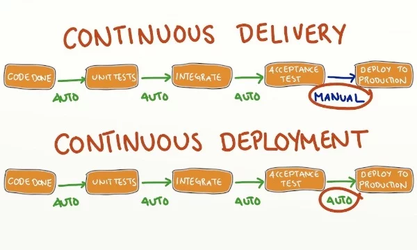

# Testing / Reproducibility

## What is Continuous Integration?

Continuous Integration (CI) is a development practice that **automates** the process of integrating code changes from multiple developers into a shared repository frequently. Each integration can then be verified by an **automated** build and **automated** tests. CI does not necessarily mean automated testing, but it is usually implied.

> *Continuous Integration doesn’t get rid of bugs, but it does make them dramatically easier to find and remove.*
> Martin Fowler, Chief Scientist, ThoughtWorks

## What is Continuous Delivery?

Continuous Delivery is an extension of Continuous Integration in that the codebase needs to be kept deployable at any point. In this phase an **automated** tool generates the configuration and build artifact(s).

## What is Continuous Deployment?

Continuous Deployment is the final phase of the process and basically **automates** the deployment of the build artifacts into a production system.

## What is the benefit of CI/CD?

* Reduces Risk

* Better communication

* Faster interations/feedback

* Enable scaling

* New developer comfort

## What are some of the challenges of CI/CD?

* Adoption and installation

* Technology learning curve
