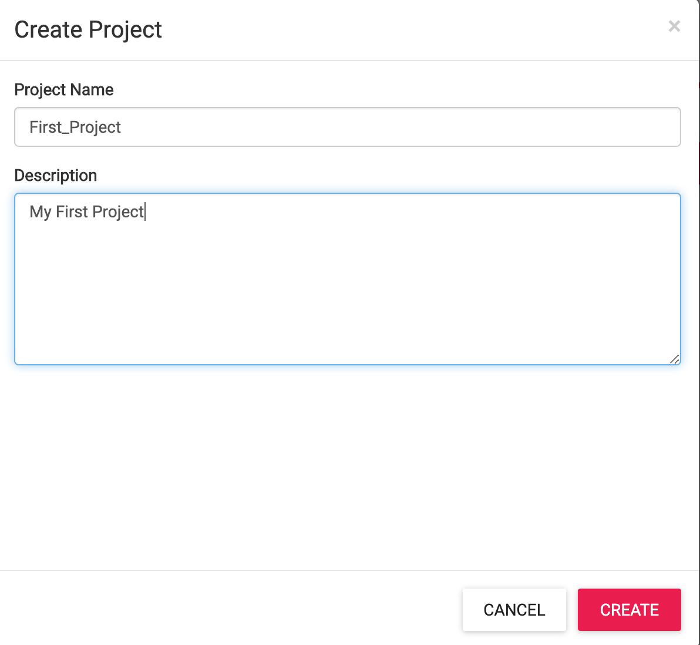
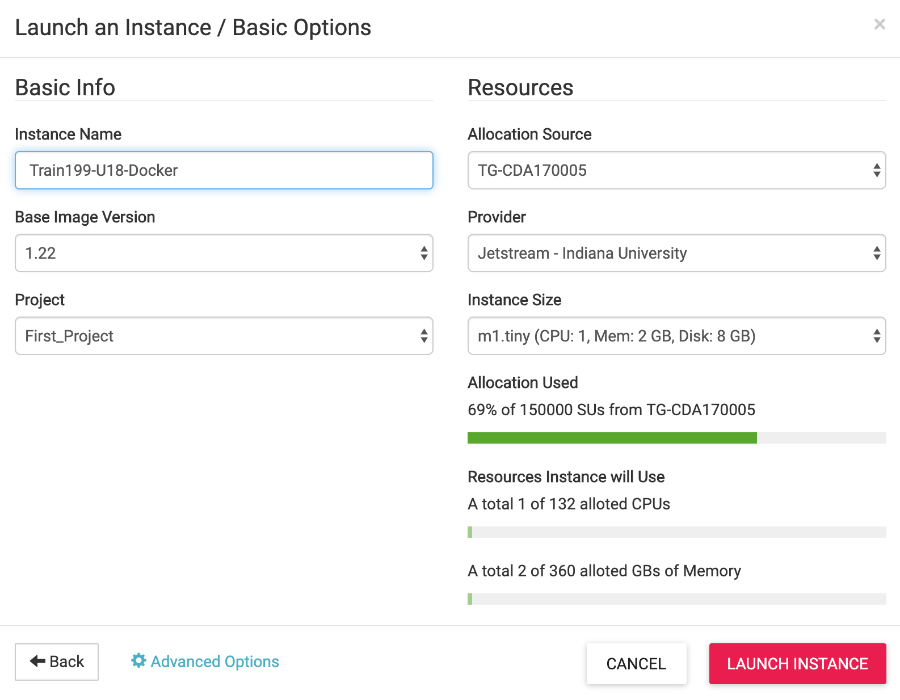
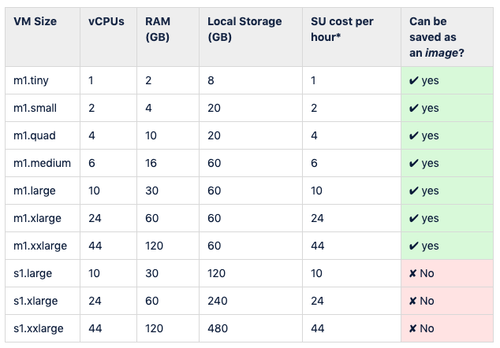

## Launch (Deploy) an Instance
---

1. Jetstream virtual machines (VMs) are organized by projects.
 * To access projects, click on  from any screen.
 * To create a new project click .
 * Fill out the name and description.  .  Best practice is to name a project something concise and informative so that, along with the description, one can quickly identify instance roles.

2. Jetstream VMs may be started clicking `New> Instance`.   .
 * This shows a catalog of `Images`: _Instances whose configurations have been saved as template from which to launch identical Instances_.
 * On the list of images page, scroll through the the list of images or enter an image name, tag or description in the search box. For instance, to locate images named or tagged with “Docker”, enter that text in the search bar. The search is not case sensitive.  
  .
  * `Featured` (system maintained) and `Public` images are shown. `Featured` images are recommended as these have been tested by Jetstream staff.

3.  Selecting an image will show the `Launch an Instance / Basic Options` screen:

    * Enter a **name** for the instance
    * Select the image **version** if there are multiple versions available
    * Select or change the **project** to hold this instance.
    * Indicate the **allocation** source.  Allocations govern how much compute resources are available. These can be change on the fly.
    * Choose the **provider** to run on, Indiana or TACC. Currently Jetstream has two partially independent clouds. Some resources, like storage **Volumes**, are accessible only **within** the same provider.
    * Choose the **instance size**.  This indicates the vCPUs, memory, and disk size for the VM. See the [Virtual Machine Sizes table](https://wiki.jetstream-cloud.org/Virtual+Machine+Sizes+and+Configurations) to show the available options and the SUs consumed per hour. 
    * Check projected resource usage: **Allocation Used** and **Resources Instance will Use**.
    * Click `Launch Instance` to start the initialization and build of the instance.

4. When the instance is finished building and deploying, you'll see the label changes to *Status* "●  **Active**" and shows the IP Address:   

5. Click on the Instance name to see the characteristics of the Instance as well a various [management actions](https://wiki.jetstream-cloud.org/Instance+management+actions) that can be taken.
 + **Image**: create a new Image from this Instance)
 + **Suspend**: put the Instance to "sleep"
 + **Shelve**: shutdown and store the Instance
 + **Stop**: shutdown the Instance but do not store
 + **Reboot**: restart the instance
 + **Redeploy**: renew the cloud and IP status of the instance
 + **DELETE**: remove the Instance
 + **Open Web Shell**: Open a terminal window (command line) to the Instance
 + **Open Web Desktop**: Open a VNC Desktop to the Instances

 Note: avoid `Old WebShell` or `Old WebDesktop` as these are deprecated and going away soon.

 

---

 

Next: [Webshell to VM](vm_webshell.md) | Top: [Course Overview](../../index.md)
