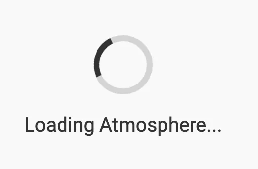
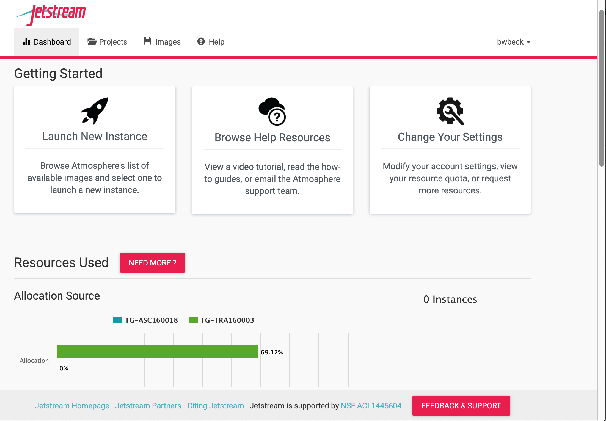

# Initial cloud setup
Before we can create an launch a Virtual Machine Instance, we need to first login to Jetstream:

1. Navigate to <https://use.jetstream-cloud.org>.

2. Click `Login` in the top right to authenticate using your XSEDE credentials:

3. On the Globus Auth screen select `XSEDE` and click Continue.

4. Enter your XSEDE credentials.  (Use the `train###` information we handed out in class). Best results will occur if you treat your username as if it were case-sensitive when using Jetstream.  

<!-- 5. After you type in your XSEDE username and password:
 * confirm whether you will allow your credentials to be used to access Jetstream.
 * You may wish to review the terms of service and privacy policies linked on that page.
 * Generally, this screen will only be displayed when there are changes to `Globus Auth`.  To use Jetstream, click `Allow`.
 -->

5. After clicking `Allow`, the web interface to Jetstream called `Atmosphere` will load.

6. The Jetstream `Dashboard` will be displayed.  On this page you will be able to:

     * launch a new **Instance** (virtual computer)
     * browse **help** resources
     * change **settings**
     * view **resources** and usage **history**

 

---

 

Next: [Deploy VM](vm_deploy.md) | Top: [Course Overview](../../index.md)
