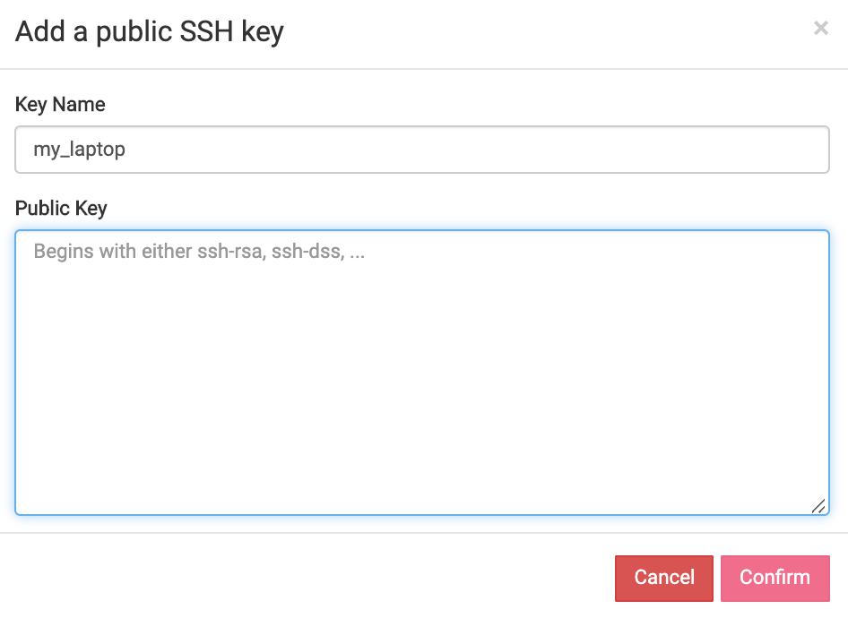

# Initial cloud setup
Before we can create an launch a Virtual Machine Instance, we need to first login to Jetstream:

1. Navigate to <https://use.jetstream-cloud.org>.

2. Click `Login` in the top right to authenticate using your XSEDE credentials:


3. On the Globus Auth screen select `XSEDE` and click Continue.


4. Enter your XSEDE credentials. Best results will occur if you treat your username as if it were case-sensitive when using Jetstream. <br>


5. After you type in your XSEDE username and password:
 * confirm whether you will allow your credentials to be used to access Jetstream.
 * You may wish to review the terms of service and privacy policies linked on that page.
 * Generally, this screen will only be displayed when there are changes to `Globus Auth`.  To use Jetstream, click `Allow`.


6. After clicking `Allow`, the web interface to Jetstream called `Atmosphere` will load.


7. The Jetstream `Dashboard` will be displayed. <br>On this page you will be able to:

     * launch a new **Instance** (virtual computer)
     * browse **help** resources
     * change **settings**
     * view **resources** and usage **history**


---
## Launch (Deploy) an Instance
---

1. Jetstream virtual machines (VMs) are organized by projects.
 * To access projects, click on  from any screen.
 * To create a new project click .
 * Fill out the name and description. <br>.<br> Best practice is to name a project something concise and informative so that, along with the description, one can quickly identify instance roles.

2. Jetstream VMs may be started clicking `New>Instance`. <br> .
 * This shows a catalog of `Images`: _Instances whose configurations have been saved as template from which to launch identical Instances_.
 * On the list of images page, scroll through the the list of images or enter an image name, tag or description in the search box. For instance, to locate images named or tagged with “Docker”, enter that text in the search bar. The search is not case sensitive.  
  .
  * `Featured` (system maintained) and `Public` images are shown. `Featured` images are recommended as these have been tested by Jetstream staff.


3.  Selecting an image will show the `Launch an Instance / Basic Options` screen:


    * Enter a **name** for the instance
    * Select the image **version** if there are multiple versions available
    * Select or change the **project** to hold this instance.
    * Indicate the **allocation** source. <br>Allocations govern how much compute resources are available. These can be change on the fly.
    * Choose the **provider** to run on, Indiana or TACC.<br>Currently Jetstream has two partially independent clouds.<br>Some resources, like storage **Volumes**, are accessible only **within** the same provider.
    * Choose the **instance size**. <br>This indicates the vCPUs, memory, and disk size for the VM. See the [Virtual Machine Sizes table](https://wiki.jetstream-cloud.org/Virtual+Machine+Sizes+and+Configurations) to show the available options and the SUs consumed per hour.<br>
    * Check projected resource usage: **Allocation Used** and **Resources Instance will Use**.
    * Click `Launch Instance` to start the initialization and build of the instance.


4. When the instance is finished building and deploying, you'll see the label changes to *Status* "<font style="color:Green;">● </font> **Active**" and shows the IP Address: <br> 

5. Click on the Instance name to see the characteristics of the Instance as well a various [management actions](https://wiki.jetstream-cloud.org/Instance+management+actions) that can be taken.
 + **Image**: create a new Image from this Instance)
 + **Suspend**: put the Instance to "sleep"
 + **Shelve**: shutdown and store the Instance
 + **Stop**: shutdown the Instance but do not store
 + **Reboot**: restart the instance
 + **Redeploy**: renew the cloud and IP status of the instance
 + **DELETE**: remove the Instance
 + **Open Web Shell**: Open a terminal window (command line) to the Instance
 + **Open Web Desktop**: Open a VNC Desktop to the Instances

 Note: avoid `Old WebShell` or `Old WebDesktop` as these are deprecated and going away soon.

### Using WebShell to Access Your Instance
WebShell (based on Guacamole) provides a web-based alternative to terminal command line software for rapid access or for those times when you installing a terminal is not an option.

 * click on `Open Web Shell` to open a new browser tab/window.<br>
 * You will automatically be logged in to an account that uses your `XSEDE` credentials **without** having to enter your password.
 * Note: Only one webshell is available per browser unless `INCOGNITO` mode is used.

 #### Because `web shell` is browser-based, Copy and Paste functions require extra steps.

 * Type `Shift-Ctrl-Alt` (Win) or `Shift-Ctrl-Opt` (Mac) to bring up the `copy-paste clipboard` pane
 * paste text in the clipboard
 * `Shift-Ctrl-Alt` to close the clipboard
 * Text in the clipboard may be pasted now with `Shift-Ctrl-V` or `right-clicking`
 * Alternatively, selecting text in the `WebShell` automatically places it in the Clipboard where it may be cut or pasted normally.
 

### Using Terminal Software to SSH Into Your Instance
Unlike `WebShell`, terminal software needs two additional pieces of information:

 1. The IP Address of your instance: <br> <br>

 2. The SSH Keys of the machine from which you're connecting

##### Setup SSH Keys
SSH public keys must be added to your Atmosphere settings:
1. To add your ssh key(s) to Jetstream, click on your `<username>` in the upper right hand corner and then click `Settings`.

    


2.  On the `Settings` screen, under `Advanced`, click `Show More`, to expand the section for adding your SSH key.  Click the blue/green plus sign to actually add your key.

    


3. On the next screen give the key a descriptive name (e.g. Smith_laptop) and then paste the contents of your PUBLIC ssh key into the dialog box.<br>
<br>
 * In Linux and MacOS you can find your originating Public SSH key via:
 ```
 cat ~/.ssh/id_rsa.pub
 ```

4. After you have pasted in your SSH key, click `Confirm`.  You will then be back at the Settings screen with your key shown in the SSH Configuration section.

5. **You must redeploy or reboot** an instance WHENEVER adding or updating your SSH public-keys in order to have those keys added to the instance.


#### Terminal Software:
#### MacOS X & Unix/Linux Terminal
* **Mac OS X**: open a terminal window (from Finder, go to Applications, click Utilities, and then double-click Terminal) or type ⌘-space to get Spotlight and type `terminal` and select `Terminal.app`.
* **Linux**: there are many terminal options, including xterm, konsole, or gnome-terminal.
* In the terminal window, enter the following command, using your XSEDE username and the instance IP address:
```
ssh <your_xsede_username>@<instance_ip_address>
```

Press `<Enter>`.
A successful login will look similar to the following:


#### Windows Terminal using PuTTY
PuTTY is an SSH client for Windows.  It operates a bit differently than Terminal to make the initial SSH connection. For a useful guide to using PuTTY, see [PuTTY – Remote Terminal and SSH Connectivity](https://support.suso.com/supki/SSH_Tutorial_for_Windows).

1. Download the PuTTY application.
2. Launch PuTTY.
3. The first time PuTTY is used for login, add your private key.
  * Single click the "Default Settings" session to save your private key for all future sessions.
  * Click on the + symbol next to the 'SSH' category on the left hand side.
  * Click on the 'Auth' category to bring up the PuTTY Configuration screen (see screenshot below).
  * The key is set down at the bottom under 'Private key file for authentication'. Click on the Browse button next to the 'Private key file for authentication' field and locate your private key file on the file system. Select the file and press 'Ok'. (It is probably in your My Documents folder. )
  * Click the 'Session' category from the left hand side.
  * Make sure "Default Settings" is still selected.
  * Click Save.

Enter the IP address, either copied from your My Instances list or from the confirmation email, and click Connect.
Enter your XSEDE username when prompted for a login name and click Enter.


---

### ___Storage Volumes___
**Volumes** are small virtual filesystems that may be attached to running/actice Instances.
Files/data saved to a **Volume** are maintained across successive attachment/detachment actions and can be moved between Instances.

#### Creating a Volume
A Volume must be created before it can be attached to an active Instance.

From the Jetstream Atmosphere `Dashboard`:
 * Click on `Projects`
 * Select your Project
 * Click `New>Volume`<br>
 * A window will pop up in which you can:<br>
  * **Name** the Volume relative to the contents
  * Enter the desired **volume size** <br>(subject to your allocation limits)
  * Select the **Provider** on which the Volume will reside. <br>Note: ___Volumes can only be attached to Instances on the same provider___.

After creation, the volume will appear in your list of available volumes:


#### Attaching a Volume
After creation a volume can be attached to an Instance on the same provider.
 * Click on the Volume **name**
 * On the next page under `Actions`, click `Attach`<br>
 * You can select any **active** Instance in the same provider<br>
 * The Volume will be automatically mounted on the selected Instance with a device and directing name corresponding alphabetically to the order of attachment.
  * e.g. the first volume attached volume will be the second device, so will be mounted as `/dev/sdb` in directory `/vol_b`.
  ```
[USER@js-169-6 ~]$ df -kh
Filesystem      Size  Used Avail Use% Mounted on
/dev/sda1        59G  3.0G   54G   6% /
tmpfs           7.8G  148K  7.8G   1% /dev/shm
/dev/sdb        9.9G  151M  9.2G   2% /vol_b
  ```

  #### Detaching a Volume
  Volumes can only be detached from `ACTIVE` Instances but any files/data currently stored on the Volume will be maintained.

  To detach a Volume:
  * Select a desired `Dashboard> Project> Volume`
  * Click  in `Actions` menu
  * Volumes will not successfully detach if they are in-use.
    * From the command-line you can try <br>`fuser -km /<volume>` <br>to kill any processes using a volume


---

### Atmosphere Command Line Utilities

Jetstream has a command-line alternative to the Atmosphere web-interface, called `atmo`. `atmo` provides the same control of Instances and Volumes that the web-interface does.

#### Installation:
`atmo` can be installed into any Linux/MacOS environment using:

```
pip install --user atmospher-cli
```
Two specific environment variables allow one to point `atmo` at your account on Jetstream. We recommend you add these to your `.bashrc` file in your `$HOME` directory:
```
export ATMO_BASE_URL="https://use.jetstream-cloud.org"
export ATMO_AUTH_TOKEN="fff28djdFAKETOKENfff28djdFAKETOKENfff28djd"
```

#### Token:
To get a Personal Access Token:

* Browse to your web `Dashboard`
* Access your `Login> Settings` in the top right <br>
* Click on `Show More` under `Advance`.
* Scroll down to `Persona Access Tokens` and Click on the `+` button
* Give your token a name and click on "Create Token"<br>
* Save this Token by clicking on the "Copy" button and pasting it somewhere you can recover it.<br>
___THIS IS YOUR ONLY CHANCE TO SAVE THIS TOKEN.
YOU WILL HAVE TO DELETE THE TOKEN AND START OVER IF YOU DO NOT SAVE IT.___
* Replace this token in the ATMO_AUTH_TOKEN line in your `.bashrc` as as previously mentioned.

#### `atmo` Usage:
In your terminal type:
```
prompt> atmo --help
usage: atmo [--version] [-v | -q] [--log-file LOG_FILE] [-h] [--debug]
            [--atmo-base-url <atmosphere-base-url>]
            [--atmo-auth-token <atmosphere-auth-token>]
            [--atmo-api-server-timeout <atmosphere-api-server-timeout>]

           Atmosphere CLI

           optional arguments:
             --version             show program's version number and exit
             -v, --verbose         Increase verbosity of output. Can be repeated.
             -q, --quiet           Suppress output except warnings and errors.
             --log-file LOG_FILE   Specify a file to log output. Disabled by default.
             -h, --help            Show help message and exit.
             --debug               Show tracebacks on errors.
             --atmo-base-url <atmosphere-base-url>
                                   Base URL for the Atmosphere API (Env: ATMO_BASE_URL)
             --atmo-auth-token <atmosphere-auth-token>
                                   Token used to authenticate with the Atmosphere API
                                   (Env: ATMO_AUTH_TOKEN)
             --atmo-api-server-timeout <atmosphere-api-server-timeout>
                                   Server timeout (in seconds) when accessing Atmosphere
                                   API (Env: ATMO_API_SERVER_TIMEOUT)

           Commands:
             allocation source list  List allocation sources for a user.
             allocation source show  Show details for an allocation source.
             complete       print bash completion command (cliff)
             group list     List groups for a user.
             group show     Show details for a group.
             help           print detailed help for another command (cliff)
             identity list  List user identities managed by Atmosphere.
             identity show  Show details for a user identity.
             image list     List images for user.
             image search   Search images for user.
             image show     Show details for an image.
             image version list  List image versions for an image.
             image version show  Show details for an image version.
             instance actions  Show available actions for an instance.
             instance attach  Attach a volume to an instance.
             instance create  Create an instance.
             instance delete  Delete an instance.
             instance detach  Detach a volume from an instance.
             instance history  List history for instance.
             instance list  List instances for user.
             instance reboot  Reboot an instance.
             instance redeploy  Redeploy to an instance.
             instance resume  Resume an instance.
             instance shelve  Shelve an instance.
             instance show  Show details for an instance.
             instance start  Start an instance.
             instance stop  Stop an instance.
             instance suspend  Suspend an instance.
             instance unshelve  Unshelve an instance.
             maintenance record list  List maintenance records for Atmosphere.
             maintenance record show  Show details for a maintenance record.
             project create  Create a project.
             project list   List projects for a user.
             project show   Show details for a project.
             provider list  List cloud providers managed by Atmosphere.
             provider show  Show details for a cloud provider.
             size list      List sizes (instance configurations) for cloud provider.
             size show      Show details for a size (instance configuration).
             version        Show Atmosphere API version.
             volume create  Create a volume.
             volume delete  Delete a volume.
             volume list    List volumes for a user.
             volume show    Show details for a volume.
```

Try:
* Get a list of providers:

```
prompt> atmo provider list
+----+--------------------------------------+--------------------------------+-----------+----------------+--------+--------+------------+
| id | uuid                                 | name                           | type      | virtualization | public | active | start_date |
+----+--------------------------------------+--------------------------------+-----------+----------------+--------+--------+------------+
|  4 | f906a5ee-34a8-499a-9185-a35feb3d6f01 | Jetstream - Indiana University | OpenStack | KVM            | True   | True   | 2016-01-28 |
|  5 | 3ff65aa8-505b-48c3-aef1-aa0ada14c756 | Jetstream - TACC               | OpenStack | KVM            | True   | True   | 2016-02-16 |
+----+--------------------------------------+--------------------------------+-----------+----------------+--------+--------+------------+
```

* Get a list of Instances:

```
prompt> atmo provider list
+--------------------+--------------------+---------+----------+----------------+-----------+----------------------+---------------+------------+
| uuid               | name               | status  | activity | ip_address     | size      | provider             | project       | launched   |
+--------------------+--------------------+---------+----------+----------------+-----------+----------------------+---------------+------------+
| 690c98d0-674e-     | Train199-U18-Docke | active  |          | 149.165.156.92 | m1.tiny   | Jetstream - Indiana  | First_Project | 2019-07-22 |
| 4c7b-b6aa-         | r                  |         |          |                |           | University           |               |            |
| 20318568e90c       |                    |         |          |                |           |                      |               |            |
+--------------------+--------------------+---------+----------+----------------+-----------+----------------------+---------------+------------+
```

* Get details about an Instance:

```
prompt> atmo instance show 690c98d0-674e-4c7b-b6aa-20318568e90c
+-------------------+--------------------------------------+
| Field             | Value                                |
+-------------------+--------------------------------------+
| id                | 33652                                |
| uuid              | 690c98d0-674e-4c7b-b6aa-20318568e90c |
| name              | Train199-U18-Docker                  |
| username          | train199                             |
| identity          | Username: train199, Project:train199 |
| project           | First_Project                        |
| allocation_source | TG-CDA170005                         |
| compute_allowed   | 150000                               |
| compute_used      | 104243.322                           |
| global_burn_rate  | 4.5                                  |
| user_compute_used | 801.51                               |
| user_burn_rate    | 3.5                                  |
| image_id          | 717                                  |
| image_version     | 1.22                                 |
| image_usage       | 104243.322                           |
| launched          | 2019-07-22                           |
| image_size        | m1.tiny                              |
| image_cpu         | 1                                    |
| image_mem         | 2048                                 |
| image_disk        | 8                                    |
| status            | active                               |
| activity          |                                      |
| ip_address        | 149.165.156.92                       |
| provider          | Jetstream - Indiana University       |
| web_desktop       | True                                 |
| shell             | False                                |
| vnc               | True                                 |
+-------------------+--------------------------------------+
```

<br>

---

<br>

Next: [Building Containers](../docker_containers/docker_containers.md) | Top: [Course Overview](../../index.md)
