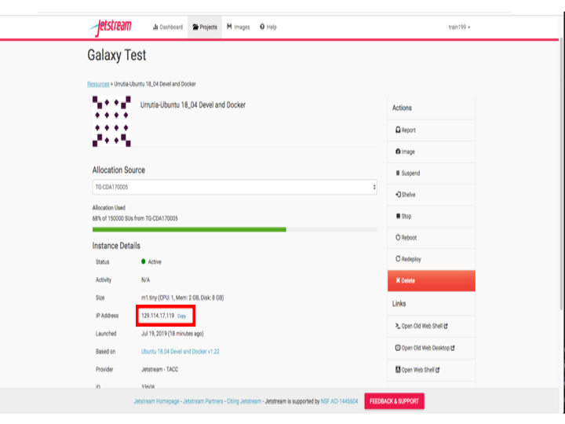
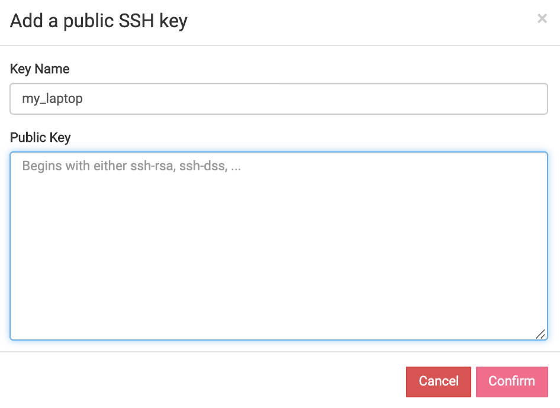
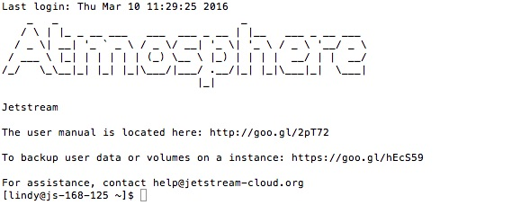
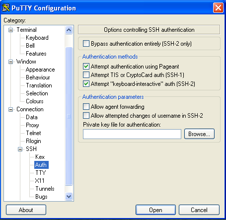

### Using Terminal Software to SSH Into Your Instance
Unlike `WebShell`, terminal software needs two additional pieces of information:

 1. The IP Address of your instance: <br> <br>

 2. The SSH Keys of the machine from which you're connecting

##### Setup SSH Keys
SSH public keys must be added to your Atmosphere settings:
1. To add your ssh key(s) to Jetstream, click on your `<username>` in the upper right hand corner and then click `Settings`.

    


2.  On the `Settings` screen, under `Advanced`, click `Show More`, to expand the section for adding your SSH key.  Click the blue/green plus sign to actually add your key.

    


3. On the next screen give the key a descriptive name (e.g. Smith_laptop) and then paste the contents of your PUBLIC ssh key into the dialog box.

<br>
 * In Linux and MacOS you can find your originating Public SSH key via:
 ```
 cat ~/.ssh/id_rsa.pub
 ```

4. After you have pasted in your SSH key, click `Confirm`.  You will then be back at the Settings screen with your key shown in the SSH Configuration section.

5. **You must redeploy or reboot** an instance **WHENEVER** adding or updating your SSH public-keys in order to have those keys added to the instance.


#### Terminal Software:
#### MacOS X & Unix/Linux Terminal
* **Mac OS X**: open a terminal window (from Finder, go to Applications, click Utilities, and then double-click Terminal) or type ⌘-space to get Spotlight and type `terminal` and select `Terminal.app`.
* **Linux**: there are many terminal options, including xterm, konsole, or gnome-terminal.
* In the terminal window, enter the following command, using your XSEDE username and the instance IP address:
```
ssh <your_xsede_username>@<instance_ip_address>
```

Press `<Enter>`.
A successful login will look similar to the following:



#### Windows Terminal using PuTTY
PuTTY is an SSH client for Windows.  It operates a bit differently than Terminal to make the initial SSH connection. For a useful guide to using PuTTY, see [PuTTY – Remote Terminal and SSH Connectivity](https://support.suso.com/supki/SSH_Tutorial_for_Windows).

1. Download the PuTTY application.
2. Launch PuTTY.
3. The first time PuTTY is used for login, add your private key.
  * Single click the "Default Settings" session to save your private key for all future sessions.
  * Click on the + symbol next to the 'SSH' category on the left hand side.
  * Click on the 'Auth' category to bring up the PuTTY Configuration screen (see screenshot below).
  * The key is set down at the bottom under 'Private key file for authentication'. Click on the Browse button next to the 'Private key file for authentication' field and locate your private key file on the file system. Select the file and press 'Ok'. (It is probably in your My Documents folder. )
  * Click the 'Session' category from the left hand side.
  * Make sure "Default Settings" is still selected.
  * Click Save.

Enter the IP address, either copied from your My Instances list or from the confirmation email, and click Connect.
Enter your XSEDE username when prompted for a login name and click Enter.



<br>

---

<br>

Next: [Volumes](vm_volumes.md) | Top: [Course Overview](../../index.md)
