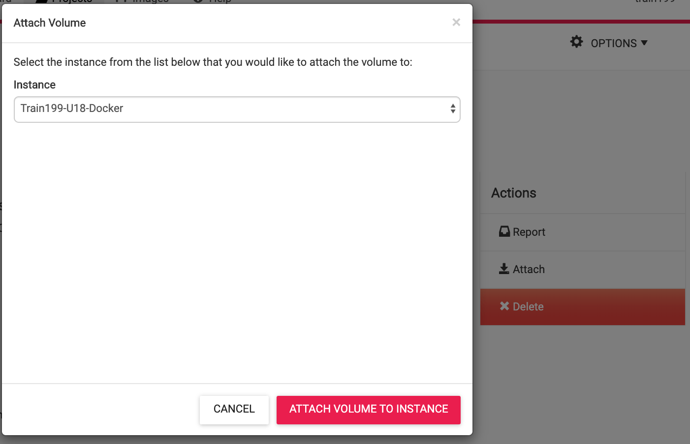
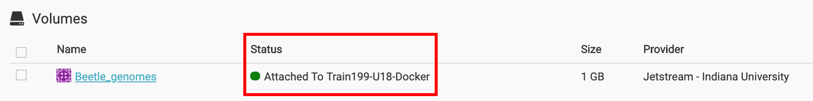

### ___Storage Volumes___
**Volumes** are small virtual filesystems that may be attached to running/actice Instances.
Files/data saved to a **Volume** are maintained across successive attachment/detachment actions and can be moved between Instances.

#### Creating a Volume
A Volume must be created before it can be attached to an active Instance.

From the Jetstream Atmosphere `Dashboard`:
 * Click on `Projects`
 * Select your Project
 * Click `New>Volume`<br>
 * A window will pop up in which you can:<br>
  * **Name** the Volume relative to the contents
  * Enter the desired **volume size** <br>(subject to your allocation limits)
  * Select the **Provider** on which the Volume will reside. <br>Note: ___Volumes can only be attached to Instances on the same provider___.

After creation, the volume will appear in your list of available volumes:


#### Attaching a Volume
After creation a volume can be attached to an Instance on the same provider.
 * Click on the Volume **name**
 * On the next page under `Actions`, click `Attach`<br>
 * You can select any **ACTIVE** Instance in the same provider<br>
 * The Volume will be automatically mounted on the selected Instance with a device and directory name corresponding alphabetically to the order of attachment.
  * e.g. the first volume attached will be the second device (`/dev/sdb`) after the Instance root directory (`/dev/sda`), and will be mounted as in directory `/vol_b`.

  ```
[USER@js-169-6 ~]$ df -kh
Filesystem      Size  Used Avail Use% Mounted on
/dev/sda1        59G  3.0G   54G   6% /
tmpfs           7.8G  148K  7.8G   1% /dev/shm
/dev/sdb        9.9G  151M  9.2G   2% /vol_b
  ```

  ### Detaching a Volume

  Volumes can only be detached from `ACTIVE` Instances but any files/data currently stored on the Volume will be maintained.

  To detach a Volume:
  * Select a desired `Dashboard> Project> Volume`
  * Click  in the `Actions` menu
  * Volumes will fail to detach if they are in-use.
    * From the command-line you can try <br>`fuser -km /<volume>` <br>to kill any processes using a volume


<br>

---

<br>

Next: [Atmo CLI](vm_atmo-cli.md) | Top: [Course Overview](../../index.md)
